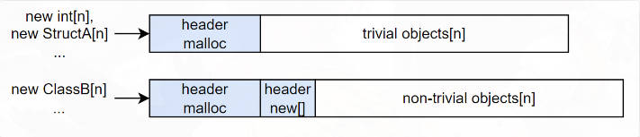

#### 内存分页与虚拟内存机制

（1）分页：将内存划分为一个个页（page），每个页都是相同大小的划分单位(通常大小为4KB)

- C++：堆、栈、代码段、全局区

（2）虚拟内存：

- 每个进程有自己独立的虚拟内存空间，通过页表映射为物理内存空间
- 通过页表可以查询映射关系，由于地址空间较大因而页表通常有多级
- 访问页表本身也是一种访存，因而增加了一级页表的cache称为TLB(快表)
- 每个进程都有自己独立的虚拟内存，高地址的内核空间 + 低地址的用户空间

（3）Swap机制：

- 虚拟内存远大于物理内存，因而会将外存(磁盘)作为额外的物理存储介质，通过一定换入换出机制使得用户感觉可以使用一个超大的内存空间
- 由于存在外存换入换出的IO，因而会引入额外的延迟(时间换空间)

（4）zRAM技术

- 是一种辅助Swap机制的软件方法，首先对物理内存专门划分出一块区域zRAM，当物理内存不足时将需要换到外存的物理内存压缩后放到物理内存上，当需要用到该物理内存时再解压出来。

（5）移动端虚拟内存

- 问题：移动端读写寿命短，所以不会用Swap机制
- 物理内存轻微不足时：删除干净页，zRAM技术
- 物理内存继续不足时：各进程通知memory warning，收到通知的进程调用自定义函数主动释放内存
- 物理内存严重不足时：按照优先级干掉进程直到物理内存足够

#### 虚拟内存分配

（1）read：文件内容先缓存进内核空间的 page cache 里，然后再将 page cache 的内容拷贝到用户空间的 buffer 中

（2）write：在将修改后的用户空间 buffer 内容复制到内核空间的 page cache 上，然后内核空间再把 page cache 的内容立即回写到文件上

（3）mmap：将虚拟空间映射到外存文件(文件内容缓存进page cache，虚拟内存映射到page cache)

- 修改虚拟内存后，page cache不会立即写回，可以多次修改一起写回
- 在处理大文件/频繁访问文件的情况，我们应当利用 mmap 来读写文件而非传统的 read/write

- 匿名映射(将用户空间的一段虚拟内存直接映射到某段物理内存)，匿名页(该段虚拟内存)

（4）malloc/free：分配虚拟内存，虚拟内存第一次被访问后才会真正分配物理内存空间(OS的写时分配行为)

- 分配内存块前塞入header数据(包含尺寸等信息)
- malloc分配内存首地址自动对齐
- malloc不一定会调用系统调用
  - 首先尝试在自己的内存池中寻找有无空闲空间
  - 如果用户分配的内存小于128KB，通过系统调用brk将内存块上移一小块位置并返回器内存块地址，归还时缓存在内存池中
  - 如果用户分配的内存大于128KB，通过系统调用mmap()申请内存(虚拟内存映射物理内存)，并在munmap时把内存归还给操作系统

（5）new/delete：

- 在使用 new[]来分配内存时需要额外插入多一个header用来存放objects数量
  - 这里int struct都可以通过sizeof得到大小从而获取到数量
  - 但是class因为存在子类赋值给基类的现象所以不一定能知道该类的具体大小

（6）内存问题：

- 内存碎片：因为被过多的碎片切割了自由内存，即使自由内存表面上有足够的空间分配，但分配请求仍然可能会失败。
- 内存扩散：多次连续分配的内存在物理空间中不容易连续，从而导致 cache 命中率越来越低

（7）多线程环境：malloc/free本身线程安全，但是其内部需要加全局锁造成性能下降

#### 内存分配策略

（1）栈式分配器：不断地再分配内存块出去，但释放内存行为却不做任何操作

（2）基于栈区/静态存储区的内存资源：不需要malloc

（3）单帧内存分配器：分配的内存仅在当前帧有效，结束时自动释放掉所有内存

（4）双缓冲内存分配器：分配的内存在当前帧和下一帧有效

（5）可回收内存分配器：

- 空闲链表法：将释放的内存添加到空闲链表中
- 自动整理碎片
- 自动垃圾回收：单次标记批量回收

（6）对象池：存放相同类型对象结构的内存池

（7）等尺寸类型分配器(size-class allocator)：将等尺寸的各个类型视为同一类型，既能保持池的块仍然等大小，也可以显著减少池的数量(例如使用8、16、32、64、128....)

（8）Grouping：解决size-class allocator对cache没有那么友好的问题，增加一个参数来额外指定从哪个组分配

- 无需额外参数的分配方式，HALO收集运行时内存分配信息并分析相关性，划分好相关性后利用BOLT(链接后优化技术)来重写二进制

#### GC垃圾回收机制

（1）算法性能评价标准：堆使用效率、访问的局部性

- 吞吐量：运行用户代码时间 / (运行用户代码时间 + 垃圾收集时间)
- 最大暂停时间：因执行GC而暂停执行应用程序的最长时间
- 堆使用效率：程序在运行过程中，单位时间内能使用的堆内存空间的大小
- 访问局部性：(寄存器-缓存-内存-辅助存储器)，部分GC算法会利用局部性原理把具有引用关系的对象安排在堆中较近的位置

（2）常用GC算法：

- 标记-清除法：标记活动对象，清除非活动对象
  - 分配：将回收的垃圾进行再利用，连接到空闲链表
  - 合并：把所有的小分块连在一起形成一个大分块
  - 缺点：会形成内存碎片、分配速度慢需要遍历空闲链表
  - 改进：
    - 利用分块大小不同的空闲链表
    - BiBOP改进碎片化，将大小相近的对象整理成固定大小块进行管理的做法

- 引用计数法：让所有对象事先记录下有多少程序引用自己
  - 优点：
    - 即刻回收垃圾，最大暂停时间
    - 没必要沿着指针查找被引用对象
  - 缺点：
    - 计数器的增减处理繁重(每次增减都需要遍历所有对象)
    - 计数器需要占用很多位
    - 循环引用无法回收
  - 改进：
    - 应用一个零数表来存储引用数变为0的问题，零数表ZCT爆满时候再扫描删除没有用的对象
    - 减少计数器位数，计数器溢出就转换为GC标记-清除法来管理

- GC复制法：只把空间中的活动对象复制到其他空间，把原空间所有对象都回收掉
  - 优点：
    - 优秀的吞吐量，跟一般的G标记清楚算法比只需要拷贝不需要清除
    - 内存告诉分配：不使用空闲链表
    - 不会发送碎片化
    - 满足告诉缓存的局部性原理
  - 缺点：
    - 堆效率使用低下
    - 不兼容保守式GC算法
    - 递归调用函数

#### UE 垃圾回收机制

（1）启动垃圾回收，加锁(保持所有对象的引用关系不变

（2）设置所有对象为 "不可达"标记(根对象、特殊对象除外)

（3）遍历根对象列表，根对象引用到的对象去除"不可达"标记

（4）收集所有仍然标记为"不可达"的对象，全部删除

#### C# 垃圾回收机制

（1）标记-清除算法

- 标记阶段：
  - 垃圾回收器从根对象(通常是静态变量、线程栈上的局部变量、CPU寄存器中的引用等)开始，递归地访问这些对象引用的所有其他对象
  - 被访问到的对象会被标记为"可达"或"存活"，某个对象没有被标记为可达那么他就被认为是"不可达"的
- 清除阶段：
  - 遍历堆内存找到所有未被标记为可达的对象
  - 释放这些垃圾对象占用的内存空间来分配给新的对象使用

#### 优化内存使用

（1）对象池化，频繁创建和销毁的对象可以考虑使用对象池来管理他们的生命周期

（2）减少大型对象的创建

（3）使用值类型代替引用类型

（4）分析内存使用情况：如使用性能分析工具来分析应用程序的内存使用情况，找出内存泄漏和不必要的内存占用

#### LRU和LRU-K

（1）缓存页面淘汰机制：

- FIFO：先入先出，优先清理最先被缓存的数据对象
- LRU：最近最久未被使用，优先清理最近没有被使用的对象。使用一个最近使用时间降序的有序队列
- LFU：使用一个使用次数降序的有序队列

（2）LRU-K，核心思想是将"最近使用过1次"的判断标准扩展为"最近使用过K次"，没有达到K次访问的数据不会被缓存，需要对缓存数据的访问次数进行计数并且访问记录不能无限记录需要使用替换算法进行替换。避免偶发性替换

参考文献：

1. [游戏架构设计：内存管理](https://www.cnblogs.com/KillerAery/p/10765893.html)