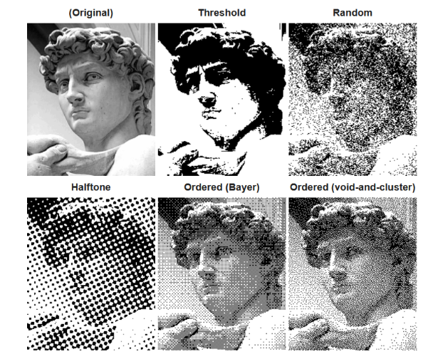
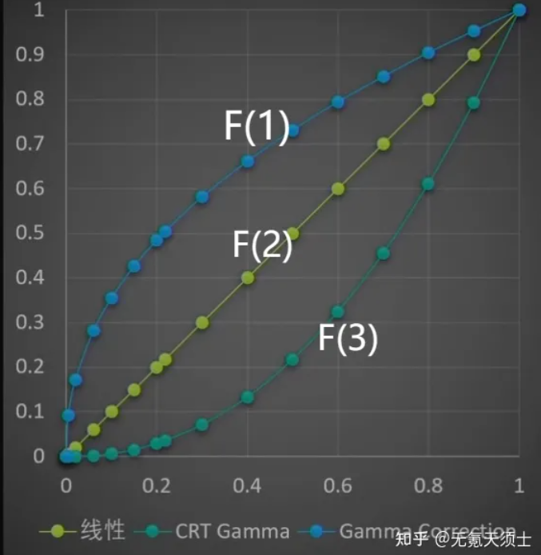
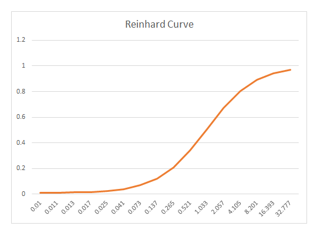
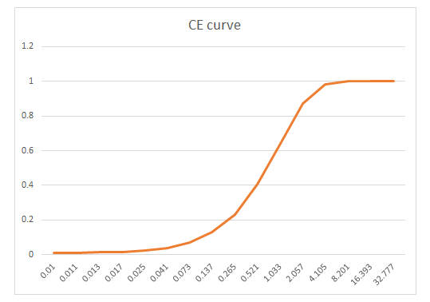
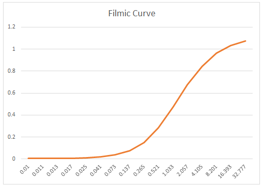
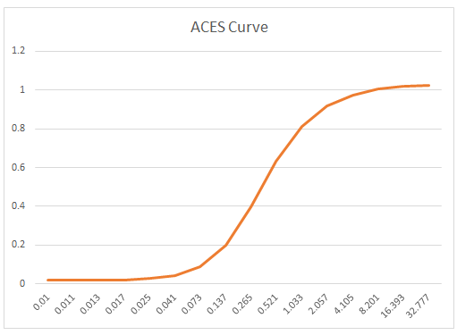

（1）常用空间：

- RGB、CMY(减色系统用于打印设备)，两者面向设备
- HSV(色调饱和度亮度)、HSL(数字化的方式来描述人的视觉感受)，两者面向用户

（2）抖动处理：用8-bit色深来模拟屏幕上百万颜色显示，利用黑白两种颜色来模拟多级灰度图像



（3）Gamma校正：

https://zhuanlan.zhihu.com/p/609569101

存在三个幂函数
$$
F(1)=Y=x^{1/2.2}\\
F(2)=Y=x^1\\
F(3)=Y=x^{2.2}
$$


计算机内部输入x，输出的亮度为y，符合F(3)，这是由于电阻损耗人眼对光的感知等客观原因

于是我们用 F(1)先对颜色值进行干涉，而平时生成图片时只要设置出图为sRGB就会自动做一次亮度校正

上述流程叫做**Gamma工作流**，而与之相对的叫做**线性工作流** 即使用上述图片时再做一次2.2的校正使得图像回到线性空间然后处理结束后再做一次0.45的校正使得输出符合人眼【像法线图，AO图，Mask图，噪声图等等直接储存数据的图片，他们在制作时保存的就是线性值，采样它们时直接用就行】通常用于 **PBR** 流程

（4）HDR和LDR

- 动态范围，声音动态范围$dB=10*lg\frac{max}{min}$  摄像领域动态范围曝光值 $EV=log_2 \frac{N^2}{t}$ N表示光圈t表示时间
- 想要保留场景中明暗变化的细节关键在于两点：①允许保留大于1.0数值②不同曝光度下拍摄多张照片记录下更大的动态范围合成到一张图上
- HRD相对于LDR来说保存浮点格式的像素颜色可以更好地保留明暗细节

（5）色调映射

- Reinhard tone mapping：亮的变暗暗的变亮

```c++
//color是线性的HDR颜色, adapted_lum是根据整个画面统计出来的亮度
float3 ReinhardToneMapping(float3 color, float adapted_lum) 
{
    const float MIDDLE_GREY = 1;
    color *= MIDDLE_GREY / adapted_lum;
    return color / (1.0f + color);
}
```



- 简单地S曲线：CE 更加快速

```c++
float3 CEToneMapping(float3 color, float adapted_lum) 
{
    return 1 - exp(-adapted_lum * color);
}
```



- Filmic tone mapping：靠人的感知去拟合高次函数

```c++
float3 F(float3 x)
{
	const float A = 0.22f;
	const float B = 0.30f;
	const float C = 0.10f;
	const float D = 0.20f;
	const float E = 0.01f;
	const float F = 0.30f;
 
	return ((x * (A * x + C * B) + D * E) / (x * (A * x + B) + D * F)) - E / F;
}

float3 Uncharted2ToneMapping(float3 color, float adapted_lum)
{
	const float WHITE = 11.2f;
	return F(1.6f * adapted_lum * color) / F(WHITE);
}
```



- ACES：解决所有设备之间颜色空间转换的问题.。最后还需要做一次0.45的gamma校正

```c++
float3 ACESToneMapping(float3 color, float adapted_lum)
{
	const float A = 2.51f;
	const float B = 0.03f;
	const float C = 2.43f;
	const float D = 0.59f;
	const float E = 0.14f;

	color *= adapted_lum;
	return (color * (A * color + B)) / (color * (C * color + D) + E);
}
```



（6）颜色查找表：

- 每个像素做两次矩阵乘法以及两次多项式运算，如果在全屏后处理中使用，性能浪费较大。目前通行的优化方案是使用**颜色查找表(Look Up Table, LUT)**，将每个像素颜色的计算过程转化为一次贴图采样

（7）Tone mapping和gamma校正：Tonemapping在线性空间，之后需要进行gamma校正


